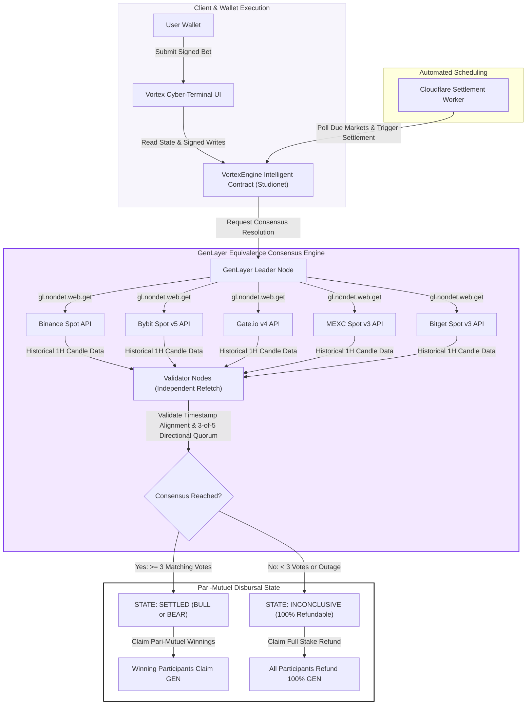

# VORTEX PROTOCOL

> **Decentralized Multi-Venue Prediction Engine Powered by GenLayer Consensus on Studionet**

[](https://docs.genlayer.com)
[](LICENSE)
[](https://github.com/k-beee/vortex-protocol)

Vortex Protocol is a high-assurance prediction engine engineered on GenLayer Studionet. It enables users to stake GEN on short-duration (1-hour UTC) directional price movements across top crypto assets (**BTC, ETH, SOL, BNB, AVAX**). Rather than relying on a single oracle or centralized operator, Vortex settles outcomes through an Intelligent Contract that fetches completed 1-hour candle data directly across five independent spot exchanges and enforces a strict 3-of-5 validator consensus.

---

## ⚡ System Architecture & Execution Flow

Below is the end-to-end consensus and settlement pipeline governing Vortex Protocol on GenLayer Studionet:



---

## 🌟 Key Stand-Out Innovations

1. **Decentralized Multi-Venue Verification (`gl.nondet.web.get`):** Eliminates single-oracle point-of-failure vulnerabilities by fetching raw spot candle data across Binance, Bybit, Gate.io, MEXC, and Bitget within the contract context.
2. **Exact-Timestamp Candle Matching:** Prevents stale price exploits or latest-tick manipulation by strictly matching historical candle opening timestamps (`candle_start`) to the market's registered UTC hour window.
3. **Pari-Mutuel Economic Settlement:** All staked GEN tokens form a transparent liquidity pool per market interval. Proportional winnings are distributed directly on-chain without protocol extraction bias.
4. **Automated Inconclusive Safety Valve:** If 3 or more exchange APIs fail, return malformed data, or disagree on direction, the Intelligent Contract automatically transitions the market to `INCONCLUSIVE`, enabling 100% GEN refunds for all participants.
5. **Directional Wallet Locking:** Prevents malicious hedging and arbitrage by locking each wallet address to a single position (`BULL` or `BEAR`) per market interval.

---

## 📐 Market Specification Matrix

| Parameter | Specification | Description |
|---|---|---|
| **Target Network** | GenLayer Studionet | Full Intelligent Contract deployment target |
| **Supported Assets** | BTC, ETH, SOL, BNB, AVAX | Quote asset pegged strictly to USDT |
| **Interval Duration** | 1 Hour (3,600s) | Aligned to exact UTC hour candles |
| **Staking Denomination** | GEN Token | Native GenLayer token |
| **Stake Bounds** | 1 GEN Min · 10 GEN Max | Cumulative per wallet per market window |
| **Consensus Threshold** | 3-of-5 Matching Votes | Requires >= 3 identical exchange directional outputs |
| **Creation Lead Time** | 30 Minutes | Markets must be initialized prior to candle opening |
| **Settlement Safety Delay** | 120 Seconds | Buffer after candle closing before resolution opens |

---

## 🛡️ Comprehensive Trust Model

| Component | Authority / Responsibility | Security Invariants |
|---|---|---|
| **Intelligent Contract** | Enforces market state machine, pari-mutuel ratios, and payouts | Cannot be bypassed by frontend or external scripts |
| **GenLayer Validators** | Independently fetch raw exchange JSON and verify consensus | Must reach >= 3 matching votes to settle |
| **Settlement Worker** | Triggers contract settlement method post-candle close | Cannot modify settlement outcome or submit false prices |
| **Exchange Venues** | Provide public historical OHLC candle data | Single venue outage does not compromise market |
| **Participants** | Submit signed GEN stake transactions before candle start | Subject to 1-10 GEN limits & direction locks |

---

## 📄 Contract Methods Overview

Contract Source: [`contract/VortexEngine.py`](contract/VortexEngine.py)

### Mutator (Write) Methods
- `open_vortex_market(asset, candle_start_timestamp)` — Initialize a new future 1-hour UTC market.
- `enter_prediction(vortex_id, target_direction)` — Stake GEN on `BULL` or `BEAR` side.
- `trigger_oracle_consensus(vortex_id)` — Initiate GenLayer 5-exchange non-deterministic web-fetching consensus.
- `claim_reward_payout(vortex_id)` — Disburse winning pari-mutuel payout share to participant.
- `claim_cancelled_refund(vortex_id)` — Disburse 100% GEN refund for inconclusive or aborted markets.
- `set_operator_address(operator)` — Admin assignment of automated settlement operator.

### View (Read) Methods
- `get_vortex_market(vortex_id)` — Return complete market record with live status.
- `get_market_state_details(vortex_id)` — Return time-aware market state flag.
- `get_user_prediction_status(vortex_id, wallet)` — Return position, stake breakdown, and claim availability.
- `get_protocol_telemetry()` — Return system-wide volume, counts, and contract balances.

---

## 📁 Repository Directory Layout

```text
vortex-protocol/
├── contract/
│   └── VortexEngine.py        # GenLayer Studionet Intelligent Contract (Python)
├── frontend/
│   ├── src/
│   │   ├── config/            # Network & Studionet contract bindings
│   │   ├── services/          # GenLayerJS client integration
│   │   ├── components/        # Cyber-terminal UI components
│   │   ├── types/             # TypeScript type definitions
│   │   ├── App.tsx            # Main application layout
│   │   └── main.tsx           # Application entry point
│   ├── index.html
│   ├── tailwind.config.js     # Memoriada-inspired cyber theme config
│   └── package.json
├── cron/
│   ├── src/
│   │   └── index.ts           # Cloudflare Automated Settlement Worker
│   ├── wrangler.toml
│   └── package.json
├── tests/
│   └── test_vortex_engine.py  # Local contract test suite
└── README.md
```

---

## 🚀 Running Locally

### Frontend Cyber-Terminal
```bash
cd frontend
npm install
npm run dev
```

### Settlement Worker
```bash
cd cron
npm install
npm run build
```

---

## 📜 License & Credits

Distributed under the **MIT License**. Built by **k_bee** for GenLayer Studionet.
