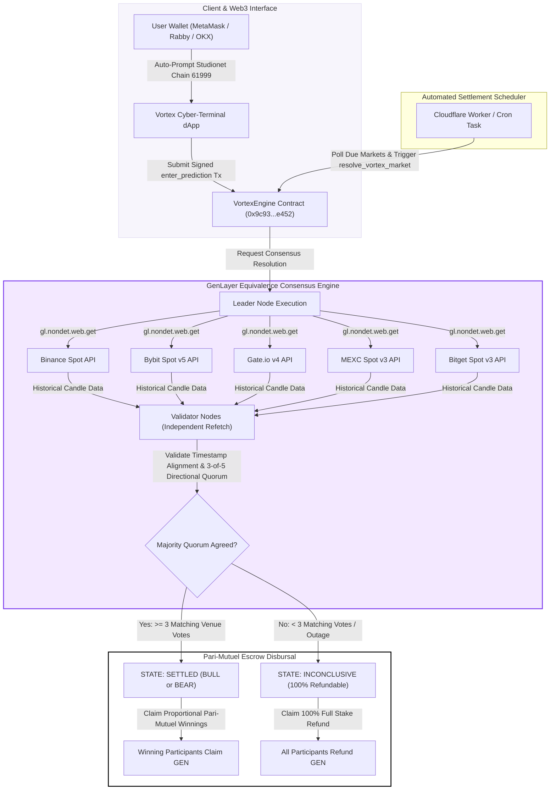

# 🌀 VORTEX PROTOCOL

> **Decentralized Multi-Venue Prediction Engine Powered by GenLayer Equivalence Consensus on Studionet**

[](https://docs.genlayer.com)
[](https://studio.genlayer.com)
[](https://vercel.com)
[](LICENSE)

---

## 📌 Executive Summary

**Vortex Protocol** is a next-generation decentralized prediction engine built on **GenLayer Studionet**. It allows participants to stake native `GEN` tokens on directional price movements (BULL vs. BEAR) across major cryptocurrency assets (**BTC, ETH, SOL, BNB, and AVAX**).

Unlike legacy Web3 prediction markets that rely on centralized oracle pushers, single-point-of-failure data feeds, or manual resolution committees, Vortex Protocol leverages **GenLayer's Intelligent Contracts** to fetch real-time historical candle data directly from five independent spot exchanges via non-deterministic HTTP calls (`gl.nondet.web.get`). Resolution is enforced through **GenLayer Equivalence Consensus**, requiring an independent 3-of-5 validator quorum before funds are unlocked for pari-mutuel disbursal.

---

## 📍 Live Studionet Contract Specifications

| Parameter | Specification Details |
|---|---|
| **Target Network** | Genlayer Studio Network (**Studionet**) |
| **Chain ID (Decimal / Hex)** | **`61999`** / |
| **RPC Endpoint** | `https://studio.genlayer.com/api` |
| **Intelligent Contract Address** | **`0x9c939da7CC0B508c7Ae3BCC39980a0462e16c452`** |
| **Supported Asset Pairs** | `BTC/USDT`, `ETH/USDT`, `SOL/USDT`, `BNB/USDT`, `AVAX/USDT` |
| **Oracle Venues** | `Binance`, `Bybit`, `Gate.io`, `MEXC`, `Bitget` |

---

## ⚡ System Architecture & Execution Flow

The diagram below illustrates the end-to-end consensus, non-deterministic oracle fetching, and pari-mutuel settlement pipeline:



---

## 🧮 Mathematical Formulation & Game Theory

### 1. Pari-Mutuel Escrow Pool Disbursal
Vortex Protocol uses a zero-sum, non-custodial pari-mutuel pool model without house edge fees:

$$S_{total} = S_{bull} + S_{bear}$$

If outcome resolves to **BULL**, winning participant $i$ claiming stake $s_i \in S_{bull}$ receives:

$$P_{i} = s_i + \left( \frac{s_i}{S_{bull}} \times S_{bear} \right)$$

If outcome resolves to **BEAR**, winning participant $j$ claiming stake $s_j \in S_{bear}$ receives:

$$P_{j} = s_j + \left( \frac{s_j}{S_{bear}} \times S_{bull} \right)$$

### 2. Multi-Venue Consensus Threshold
Let $V = \{v_1, v_2, v_3, v_4, v_5\}$ be the set of directional outcomes fetched from the 5 spot exchange venues. The contract enforces:

$$\text{Consensus Outcome} = \begin{cases} \text{BULL} & \text{if } \sum_{k=1}^5 \mathbb{I}(v_k = \text{BULL}) \ge 3 \\ \text{BEAR} & \text{if } \sum_{k=1}^5 \mathbb{I}(v_k = \text{BEAR}) \ge 3 \\ \text{INCONCLUSIVE} & \text{otherwise} \end{cases}$$

If an exchange API is unreachable or returns malformed data, it is marked as `INVALID`. If fewer than 3 venues agree, the contract automatically transitions to `INCONCLUSIVE`, guaranteeing **100% principal refunds** for all stakers.

---

## 📁 Repository Directory Structure

```
vortex-protocol/
├── contract/
│   └── VortexEngine.py          # Intelligent Contract (GenLayer Python VM)
├── frontend/
│   ├── public/                  # Static assets & favicons
│   ├── scripts/
│   │   ├── deploy_fresh_contract.mjs
│   │   ├── open_all_markets.mjs
│   │   ├── redeploy_and_open_extended_markets.mjs
│   │   ├── generate_substantial_volume.mjs
│   │   └── test_live_flow.mjs
│   ├── src/
│   │   ├── components/          # Cyber-Terminal UI Components
│   │   │   ├── Header.tsx
│   │   │   ├── LiveTelemetryBanner.tsx
│   │   │   ├── HeroSection.tsx
│   │   │   ├── MarketCard.tsx
│   │   │   ├── PredictionModal.tsx
│   │   │   ├── ConsensusInspector.tsx
│   │   │   └── HowItWorksModal.tsx
│   │   ├── config/
│   │   │   └── vortexConfig.ts  # Studionet RPC & Network Switch Hooks
│   │   ├── services/
│   │   │   └── genlayerService.ts # On-Chain Read/Write Service
│   │   ├── types/
│   │   │   └── vortex.ts        # TypeScript Interfaces
│   │   ├── App.tsx              # Main Terminal Application
│   │   └── index.css            # Custom CSS & Terminal Design Tokens
│   ├── vercel.json              # SPA Routing Rules
│   └── vite.config.ts           # Vite Build Configuration
├── cron/
│   ├── src/index.ts             # Cloudflare Settlement Worker
│   └── wrangler.toml            # Cloudflare Worker Configuration
├── package.json                 # Root npm scripts
├── vercel.json                  # Root Vercel configuration
└── README.md                    # System Documentation
```

---

## 🛠️ Installation & Local Setup Guide

### 1. Prerequisites
- **Node.js**: `v18.0.0` or higher
- **Package Manager**: `npm` or `pnpm`
- **Web3 Wallet Extension**: MetaMask, Rabby, or OKX Wallet

### 2. Clone & Install Dependencies
```bash
git clone https://github.com/k-beee/vortex-protocol.git
cd vortex-protocol
cd frontend
npm install
```

### 3. Launch Development Terminal
```bash
npm run dev
```
Open your browser at `http://localhost:5173`. Connecting your Web3 wallet will automatically prompt your extension to switch/add **Genlayer Studio Network** (Chain ID: `61999`).

### 4. Build Production Bundle
```bash
npm run build
```

---

## 🌐 1-Click Vercel Deployment

Vortex Protocol is optimized for hosting on **Vercel**:

### Method A: Vercel Dashboard (Recommended)
1. Navigate to [Vercel Dashboard](https://vercel.com/new).
2. Import repository `https://github.com/k-beee/vortex-protocol`.
3. Set **Root Directory** to `frontend` (or leave default).
4. Click **Deploy**. Vercel will automatically build the Vite project and issue an SSL HTTPS domain!

### Method B: Vercel CLI
```bash
npx vercel --prod
```

---

## 🛡️ Security & Assurance Features

1. **Non-Custodial Escrow**: All staked `GEN` is locked in contract state until consensus resolution. Neither the admin nor operator can arbitrarily withdraw participant stakes.
2. **Equivalence Consensus Verification**: Validator nodes independently re-execute non-deterministic web requests (`gl.nondet.web.get`), preventing leader node spoofing or single API manipulation.
3. **Inconclusive Emergency Refund**: If market consensus fails due to exchange outages, 100% of staked funds are made available for immediate self-service claim.
4. **RPC Rate-Limit Pacing**: Frontend and test scripts feature backoff pacing to ensure smooth RPC communication under rate constraints.

---

## 📜 License

Distributed under the **MIT License**. Created by **k_bee** for GenLayer Studionet.
